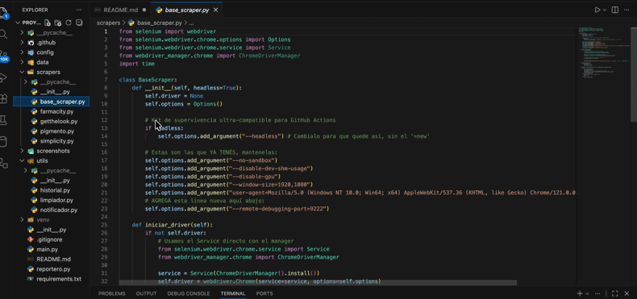

# 🛒 Smart Price Tracker & Deal Detector Bot

Bot automatizado de Scraping diseñado para monitorear precios de productos de cuidado personal en tiempo real, comparar valores históricos y notificar ofertas automáticamente vía Telegram.

## 📱 Vista previa del Bot
A continuación se muestra un ejemplo del reporte diario enviado a Telegram, incluyendo la detección automática de ofertas:

  

## 🚀 Características Principales
* **Scraping Multitienda:** Soporte para Farmacity, Pigmento, Simplicity y GetTheLook.
* **Detección de Ofertas:** Compara el precio del día contra un historial local (`CSV`) y calcula el porcentaje de ahorro.
* **Automatización Total:** Ejecución diaria programada mediante **GitHub Actions** (CI/CD).
* **Notificaciones Instantáneas:** Alertas inteligentes por Telegram con formato enriquecido.
* **Arquitectura Robusta:** Uso de Selenium en modo *headless* para ejecución en servidores en la nube.

## 🛠️ Stack Tecnológico
* **Lenguaje:** Python 3.9
* **Librerías:** Selenium, Pandas, Requests.
* **Infraestructura:** GitHub Actions (Automatización y base de datos liviana).
* **Notificaciones:** Telegram Bot API.

## 🤖 Cómo funciona el Pipeline
1. **Trigger:** GitHub Actions inicia el flujo cada mañana (Cron job).
2. **Extracción:** Los scrapers navegan las URLs configuradas y limpian los datos.
3. **Análisis:** El sistema lee el historial, detecta si el precio bajó y actualiza la base de datos.
4. **Alerta:** Si hay una rebaja, envía un mensaje detallado al usuario.

## 💻 Implementación Técnica

  

---
*Proyecto desarrollado por Máximo Pasturensi como parte de un flujo de automatización profesional.*
